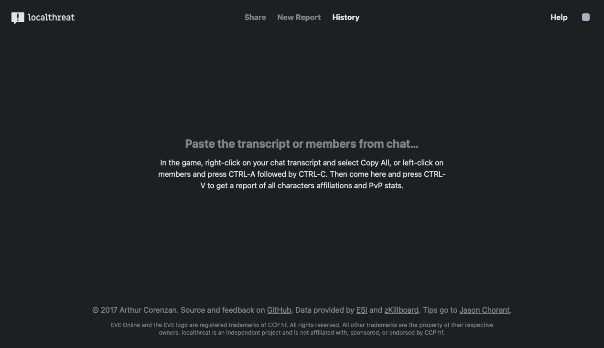

[](https://next.localthreat.xyz)

## About

**[localthreat](https://next.localthreat.xyz/)** is an online tool to help EVE players with threat assessment.

## Contribution

I do my best to keep the service running at the lowest cost possible, but it still has some. Namely the domain renewal and a \$10 virtual machine on [Digital Ocean](https://www.digitalocean.com/). Help me help you by contributing to the upkeep of localthreat. [Donate via PayPal](https://www.paypal.com/cgi-bin/webscr?cmd=_s-xclick&hosted_button_id=B9KBZJP99YAE8&source=url).

## Development

### Overview

All the code is hosted on [GitHub](https://github.com/haggen/localthreat). The design lives on [Figma](https://www.figma.com/file/BPH2xeVvbBDAnWpjMI58GpnW/localthreat.next). Bug tracking, feature request, or any other feedback must be made on the [repository's issues page](https://github.com/haggen/localthreat/issues/new).

### Easily

If you've got docker-compose 1.13.0+ installed, simply run:

```shell
$ docker-compose up
```

This will boot everything you need in one go. You can customize the runtime by editting the `docker-compose.yml` file.

### Manually

You'll need Go 1.11.1+ installed. Hop into the `api/` sub-directory and run:

```shell
$ go get
```

To download all the dependencies and then:

```shell
$ make test
$ make
```

To test and build the binary, respectively.

For persistence you'll need PostgreSQL 9.1+ running. Load the `migrate.sql` file into your database and run:

```shell
$ DATABASE_URL=postgres://postgres@localhost/postgres ./localthreat
```

To start the API server.

### Client

You'll need Node 8.10+ and yarn installed. Hop into the `client/` sub-directory and run:

```shell
$ yarn install
```

To download all the dependencies. Then run:

```shell
$ yarn start
```

To start a development server.

## Legal

[The MIT License](LICENSE) © 2017 Arthur Corenzan

EVE Online and the EVE logo are the registered trademarks of CCP hf. All rights are reserved worldwide. All other trademarks are the property of their respective owners. EVE Online, the EVE logo, EVE and all associated logos and designs are the intellectual property of CCP hf. All artwork, screenshots, characters, vehicles, storylines, world facts or other recognizable features of the intellectual property relating to these trademarks are likewise the intellectual property of CCP hf.
